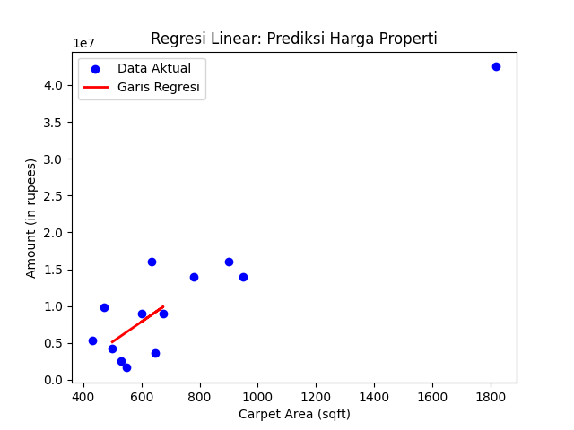

### Dokumentasi Skrip Regresi Linear

#### Pendahuluan
Skrip ini melakukan analisis regresi linear sederhana untuk memprediksi harga properti berdasarkan luas bangunan. Data properti dibaca dari file CSV, dikonversi ke format numerik yang sesuai, dan diolah untuk menghasilkan model regresi yang dapat digunakan untuk prediksi harga properti di masa mendatang.

#### Dependensi
Skrip ini memerlukan beberapa pustaka Python, yang dapat diinstal menggunakan pip:

```sh
pip install pandas numpy matplotlib scikit-learn
```

#### Struktur Skrip

1. **Import Pustaka**
    ```python
    import pandas as pd
    import numpy as np
    import matplotlib.pyplot as plt
    from sklearn.linear_model import LinearRegression
    from sklearn.model_selection import train_test_split
    from sklearn.metrics import mean_squared_error, r2_score
    ```

2. **Membaca Data dari File CSV**
    ```python
    data = pd.read_csv('linear-regression/house.csv')
    ```

3. **Mengonversi Harga dari String ke Float**
    Fungsi `convert_price` mengonversi harga properti dari format string ke float, mengabaikan nilai "Call for Price".
    ```python
    def convert_price(price):
        if pd.isna(price) or price == 'Call for Price':
            return None
        price = price.replace(',', '')
        if ' Lac' in price:
            return float(price.replace(' Lac', '')) * 100000
        elif ' Cr' in price:
            return float(price.replace(' Cr', '')) * 10000000
        else:
            return float(price)
    ```

4. **Mengonversi Luas Bangunan dari String ke Float**
    Fungsi `convert_area` mengonversi luas bangunan dari format string ke float, mengabaikan satuan "sqft" dan "sqm".
    ```python
    def convert_area(area):
        if pd.isna(area):
            return np.nan
        if ' sqft' in area:
            return float(area.replace(' sqft', '').replace(',', ''))
        elif ' sqm' in area:
            return float(area.replace(' sqm', '').replace(',', '')) * 10.7639
        else:
            return np.nan
    ```

5. **Mengonversi Kolom Harga dan Luas Bangunan**
    ```python
    data['Amount(in rupees)'] = data['Amount(in rupees)'].apply(convert_price)
    data['Carpet Area'] = data['Carpet Area'].apply(convert_area)
    ```

6. **Menghapus Baris dengan Nilai None atau NaN**
    ```python
    data = data.dropna(subset=['Amount(in rupees)', 'Carpet Area'])
    ```

7. **Memilih Fitur dan Target**
    ```python
    X = data[['Carpet Area']]  # Fitur: Luas bangunan
    y = data['Amount(in rupees)']  # Target: Harga properti
    ```

8. **Memisahkan Data untuk Pelatihan dan Pengujian**
    ```python
    X_train, X_test, y_train, y_test = train_test_split(X, y, test_size=0.2, random_state=42)
    ```

9. **Membuat Model Regresi Linear**
    ```python
    model = LinearRegression()
    model.fit(X_train, y_train)
    ```

10. **Memprediksi Harga Properti**
    ```python
    y_pred = model.predict(X_test)
    ```

11. **Menghitung Kesalahan Kuadrat Rata-rata dan Skor R^2**
    ```python
    mse = mean_squared_error(y_test, y_pred)
    r2 = r2_score(y_test, y_pred)
    ```

12. **Menampilkan Hasil**
    ```python
    print(f"Mean Squared Error (MSE): {mse}")
    print(f"R-squared (R^2) Score: {r2}")
    print(f"Slope (b1): {model.coef_[0]}")
    print(f"Intercept (b0): {model.intercept_}")
    ```

13. **Plot Data dan Garis Regresi**
    ```python
    plt.scatter(X, y, color='blue', label='Data Aktual')
    plt.plot(X_test, y_pred, color='red', linewidth=2, label='Garis Regresi')
    plt.xlabel('Carpet Area (sqft)')
    plt.ylabel('Amount (in rupees)')
    plt.title('Regresi Linear: Prediksi Harga Properti')
    plt.legend()
    plt.show()
    ```

#### Output


#### Kesimpulan
Skrip ini membaca data properti dari file CSV, mengonversi data yang diperlukan ke dalam format numerik, dan membangun model regresi linear untuk memprediksi harga properti berdasarkan luas bangunan. Hasil model ditampilkan dalam bentuk metrik evaluasi dan plot garis regresi terhadap data aktual.